# ETL Process — WawaLiceum Data Warehouse

## Schema Decisions

| Decision | Rationale |
|----------|-----------|
| `Wymiar_Profil` removed | Plan naboru 2026 is aggregate (counts by type), not individual class profiles. No FK possible. Class info stored as degenerate dims in `Fakt_Rekrutacja_Wyniki`. |
| `Fakt_Plan_Naboru` added | Separate fact for 2026 seat counts at (school, typ_oddzialu) grain |
| `Fakt_Rekrutacja_Wyniki` sourced from progi PDFs | 3 years of historical thresholds (2023/2024/2025), 2459 raw rows. `prog_punktowy_max` nullable (only 2023 PDF has max). |
| `poziom_halasu_otoczenia` removed from Wymiar_Atmosfera | No data source exists |
| `Wymiar_Czas` covers 2023–2026 | Populated from matura + ranking + progi PDFs + plan naboru |

---

## Data Flow

```mermaid
flowchart TD
    subgraph Sources
        A[RSPO.xlsx\n230 schools]
        B[Matury 2025 CSVs\n~3850 rows CP1250]
        C[2026 Ranking Perspektyw.xlsx\n101 × 4 years]
        D[Plan naboru.xlsx\n157 rows, aggregate]
        E[minimalna liczba punktów\n2023.pdf 970 rows\n2024.pdf 670 rows\n2025.pdf 819 rows]
        F[waszaedukacja.pl\nEWD tables]
        G[swiadomiewybieram.pl\natmosphere %]
        H[pl.wikipedia.org\ngeotag coordinates]
        I[Informator Licea_2026.pdf\n98 schools, 27 bit flags\n567 initiative text items]
    end

    subgraph Staging["Staging (auto-created by Python)"]
        S1[stg_rspo]
        S2[stg_matura]
        S3[stg_ranking]
        S4[stg_plan_naboru]
        S5[stg_progi\nrok/dzielnica/nazwa_szkoly\nsymbol/nazwa_oddzialu\nprog_min/prog_max]
        S6[stg_ewd]
        S7[stg_atmosfera]
        S8[stg_school_xref\nname→RSPO crosswalk\nsources: ranking, plan_naboru, progi]
        S9[stg_wiki_coords\nnumer_rspo/lat/lon]
        S10[stg_informator_flags\n98 rows, 27 bit flag cols]
        S11[stg_informator_inicjatywy\n567 rows, sekcja/element]
    end

    subgraph Warehouse["Warehouse (WawaLiceumDB)"]
        D1[Wymiar_Szkola]
        D2[Wymiar_Czas\n2023-2026]
        D3[Wymiar_Atmosfera]
        D4[Wymiar_Przedmiot_Maturalny]
        D5[Wymiar_Typ_EWD]
        F1[Fakt_Ranking_Perspektywy]
        F2[Fakt_Rekrutacja_Wyniki\nper class per year\ndegenerate dims]
        F3[Fakt_Plan_Naboru\n2026 aggregate]
        F4[Fakt_Matura_Statystyki_Szczegolowe]
        F5[Fakt_Matura_EWD]
    end

    A --> S1 --> D1
    B --> S2 --> D4 & F4
    C --> S3 --> F1
    D --> S4 --> F3
    E --> S5 --> F2
    F --> S6 --> D5 & F5
    G --> S7 --> D3
    H --> S9 --> D1
    I --> S10 & S11
    S10 --> D3
    S11 --> Mostek_Szkola_Inicjatywy
    S1 & S3 & S4 & S5 & S10 --> S8
    S8 --> F1 & F2 & F3
    D2 --> F1 & F2 & F3 & F4 & F5

    BI[Power BI] --> Warehouse
```



---

## Load Sequence

### Step 1 — Create warehouse (run once on SQL Server)
```
sqlcmd -S LaptopAgi\MSSQLSERVER1 -d WawaLiceumDB -i sql/00_create_warehouse.sql
```

### Step 2 — Load staging + scrape (run on Windows box with .venv)
```
python -m etl.load_staging
```
Load order: RSPO → Matura → Ranking → Plan naboru → Progi PDFs → Informator PDF → EWD scraper → Atmosfera scraper → Wikipedia coords → School matcher

### Step 3 — Transform to warehouse (SQL Server)
```
sqlcmd -S LaptopAgi\MSSQLSERVER1 -d WawaLiceumDB -i sql/10_transform_dims.sql
sqlcmd -S LaptopAgi\MSSQLSERVER1 -d WawaLiceumDB -i sql/20_transform_facts.sql
```

### Step 4 — Validate
```
sqlcmd -S LaptopAgi\MSSQLSERVER1 -d WawaLiceumDB -i sql/90_validation.sql
```

---

## Known Challenges

### R1 — Name→RSPO matching
Ranking, plan naboru, and progi PDFs use human-readable school names, not RSPO ids. Matcher (`etl/match/school_matcher.py`) normalises names and uses rapidfuzz fuzzy matching (threshold 75/100). Three sources now matched: `ranking`, `plan_naboru`, `progi`. Unresolved schools written to `etl/match/unresolved_names.csv` for manual correction in `etl/match/overrides.csv`.

### R2 — Progi PDF parsing (3 different formats)
| PDF | Structure | Parser strategy |
|-----|-----------|-----------------|
| 2023 (45 pages, 970 rows) | Clean 6-col table: dzielnica/nazwa/symbol/nazwa_odd/prog_min/prog_max | `extract_tables()`, detect header by non-numeric prog col |
| 2024 (24 pages, 670 rows) | 6-col table but symbol embedded in "Nazwa krótka oddziału" field | `extract_tables()`, split first token as symbol |
| 2025 (12 pages, 819 rows) | Poor column split — all merged into 1 col | x-position word grouping (5 buckets at x≈47/340/398/612) |

### R3 — Scraper fragility
EWD numbers on ewd.edu.pl are rendered via JavaScript (XHR). Primary scraper targets waszaedukacja.pl (server-rendered HTML tables). Site ids on swiadomiewybieram.pl differ from RSPO — resolved by name search. Cache stored in `etl/scrape/_cache/` (gitignored) so re-runs are fast.

### R5 — Informator PDF pictogram parsing
Pictogram icons in Informator Licea_2026.pdf are SVG/PNG objects with no alt-text. Feature presence detected by XObject reuse ID (each PDF embeds one shared XObject per icon — `X262`=strefa ciszy, `X284`=sklepik, etc.). 27 flags extracted. Two Udogodnienia icons (`X314` ~30 schools, unknown feature) excluded. Text sections additionally keyword-matched for TUS, rewalidacja, and accessibility staff.

### R4 — Encoding
Matura CSVs are Windows-1250, semicolon-delimited, decimal comma. Handled in `etl/extract/matury.py`.

---

## File Map

| File | Purpose |
|------|---------|
| `etl/config.py` | DB connection, file paths, shared constants |
| `etl/extract/rspo.py` | RSPO.xlsx → stg_rspo |
| `etl/extract/matury.py` | Matura CSVs → stg_matura |
| `etl/extract/ranking.py` | Ranking xlsx → stg_ranking (unpivoted) |
| `etl/extract/plan_naboru.py` | Plan naboru xlsx → stg_plan_naboru |
| `etl/extract/progi_pdf.py` | 3 threshold PDFs (2023/2024/2025) → stg_progi |
| `etl/scrape/ewd.py` | waszaedukacja EWD → stg_ewd |
| `etl/scrape/atmosfera.py` | swiadomiewybieram → stg_atmosfera |
| `etl/scrape/wikipedia_coords.py` | pl.wikipedia.org geotag → stg_wiki_coords → Wymiar_Szkola.wspolrzedne_* |
| `etl/extract/informator_pdf.py`  | Informator Licea_2026.pdf → stg_informator_flags (27 bit flags) + stg_informator_inicjatywy |
| `etl/match/school_matcher.py` | Fuzzy name→RSPO matching (ranking+plan+progi) → stg_school_xref |
| `etl/match/overrides.csv` | Manual name→RSPO fixes (committed) |
| `etl/load_staging.py` | Orchestrator — runs all steps above |
| `sql/00_create_warehouse.sql` | DROP + CREATE all warehouse tables |
| `sql/10_transform_dims.sql` | stg_* → Wymiar_* |
| `sql/20_transform_facts.sql` | stg_* → Fakt_* |
| `sql/90_validation.sql` | Row counts + orphan checks + showcase BI queries |
