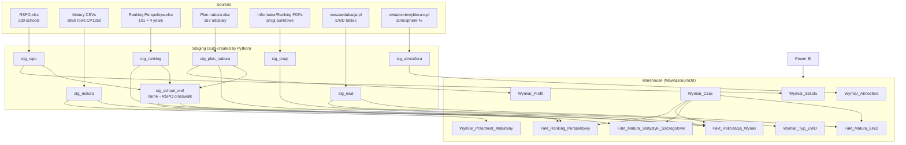

# ETL Process — WawaLiceum Data Warehouse

## Schema Review (vs. original docs/db/SkryptDDL.sql)

**Issues fixed in `sql/00_create_warehouse.sql`:**

| # | Issue | Fix |
|---|-------|-----|
| 1 | `USE WawaLiceum` — wrong DB name | Changed to `USE WawaLiceumDB` |
| 2 | `id_atmosfera` FK on `Fakt_Rekrutacja_Wyniki` — atmosphere is school-level, not per-recruitment-fact | Removed FK; `Wymiar_Atmosfera` now links directly to `Wymiar_Szkola` via `id_szkoly_rspo` |
| 3 | `wspolrzedne_lat/long`, `url_facebook/instagram` — no source data | Kept as nullable, marked "future enrichment" in comments |
| 4 | No UNIQUE constraints on facts | Added `UQ_*` constraints to prevent duplicate loads |
| 5 | Staging tables were in the DDL | Removed — staging is auto-created by Python (`to_sql`) |

**Star schema remains unchanged:** 4 fact tables + bridge + 8 dimension tables.

---

## Data Flow



---

## Load Sequence

### Step 1 — Create warehouse (run once on SQL Server)
```
sqlcmd -S LaptopAgi\MSSQLSERVER1 -d WawaLiceumDB -i sql/00_create_warehouse.sql
```

### Step 2 — Load staging + scrape (run on Windows box with .venv)
```
python -m etl.load_staging
```
Load order: RSPO → Matura → Ranking → Plan naboru → Progi PDF → EWD scraper → Atmosfera scraper → School matcher

### Step 3 — Transform to warehouse (SQL Server)
```
sqlcmd -S LaptopAgi\MSSQLSERVER1 -d WawaLiceumDB -i sql/10_transform_dims.sql
sqlcmd -S LaptopAgi\MSSQLSERVER1 -d WawaLiceumDB -i sql/20_transform_facts.sql
```

### Step 4 — Validate
```
sqlcmd -S LaptopAgi\MSSQLSERVER1 -d WawaLiceumDB -i sql/90_validation.sql
```

---

## Known Challenges

### R1 — Name→RSPO matching
Ranking and Plan naboru files use human-readable names ("XIV LO im. Staszica"), not RSPO ids. The matcher (`etl/match/school_matcher.py`) normalises names and uses rapidfuzz fuzzy matching (threshold 75/100). Unresolved schools are written to `etl/match/unresolved_names.csv` for manual correction in `etl/match/overrides.csv`.

### R2 — Progi from PDF
Point thresholds are not in any spreadsheet — they exist only in `Informator Licea_2026.pdf`. The PDF extractor (`etl/extract/progi_pdf.py`) uses pdfplumber heuristics and writes candidate rows to `stg_progi` for review. The transform SQL joins stg_progi to plan naboru on partial school name.

### R3 — Scraper fragility
EWD numbers on ewd.edu.pl are rendered via JavaScript (XHR). Primary scraper targets waszaedukacja.pl (server-rendered HTML tables). Site ids on swiadomiewybieram.pl differ from RSPO — resolved by name search. Cache is stored in `etl/scrape/_cache/` (gitignored) so re-runs are fast.

### R4 — Encoding
Matura CSVs are Windows-1250, semicolon-delimited, decimal comma. Handled in `etl/extract/matury.py`.

---

## File Map

| File | Purpose |
|------|---------|
| `etl/config.py` | DB connection, file paths, shared constants |
| `etl/extract/rspo.py` | RSPO.xlsx → stg_rspo |
| `etl/extract/matury.py` | Matura CSVs → stg_matura |
| `etl/extract/ranking.py` | Ranking xlsx → stg_ranking (unpivoted) |
| `etl/extract/plan_naboru.py` | Plan naboru xlsx → stg_plan_naboru |
| `etl/extract/progi_pdf.py` | PDF tables → stg_progi |
| `etl/scrape/ewd.py` | waszaedukacja EWD → stg_ewd |
| `etl/scrape/atmosfera.py` | swiadomiewybieram → stg_atmosfera |
| `etl/match/school_matcher.py` | Fuzzy name→RSPO matching → stg_school_xref |
| `etl/match/overrides.csv` | Manual name→RSPO fixes (committed) |
| `etl/load_staging.py` | Orchestrator — runs all steps above |
| `sql/00_create_warehouse.sql` | DROP + CREATE all warehouse tables |
| `sql/10_transform_dims.sql` | stg_* → Wymiar_* |
| `sql/20_transform_facts.sql` | stg_* → Fakt_* |
| `sql/90_validation.sql` | Row counts + showcase BI queries |
